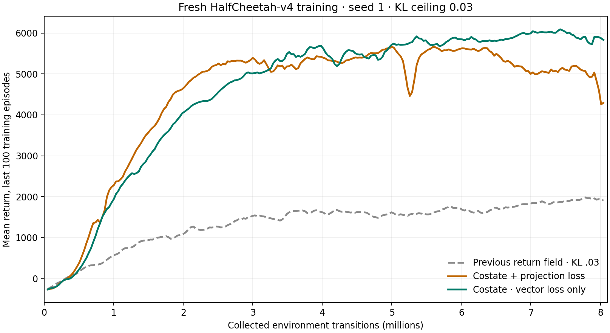

# Latent costate v10

Implementation: `cleanrl/ppo_continuous_action_latent_costate_v10.py`.
Contracts: `tests/test_latent_costate_v10.py`.

This implements the [vector costate design](vector-costate-design.md). The critic
predicts a latent covector over identity state coordinates and 32 learned
features. A Jacobian pullback turns it into a state-reward sensitivity vector.
There is no scalar value network, GAE, contrastive data, or generated future
state used for critic bootstrapping.

## Targets and optimization

A learned one-step model predicts state deltas and observed forward progress
speed. Its independent supervised targets are real physical transitions after
a fixed affine transformation, plus `reward + control_cost`. The environment's
control coefficient is read from its configuration and checked against its
reported progress reward by a numerical contract. The analytic actuator-cost
gradient is applied separately.

For each actual observed action, model VJPs carry the stopped next costate back
to state and action. A separate policy-input VJP supplies the closed-loop state
term. The next costate is evaluated on the actual observed next state. At an
episode boundary continuation is zero, while immediate reward gradients remain.

The critic loss includes the full vector Bellman residual and its corruption
of preceding-transition alpha/beta credit. The incoming action Jacobian is
shifted by the number of environments in the time-major rollout; first rows,
resets, and unknown warmup ages cannot fabricate a preceding transition.
Projection matrices are frozen during critic fitting. Eight semi-gradient
sweeps recompute targets between sweeps. No target statistic is represented by
a scalar value head.

The dynamics model fits all collected transitions for ten epochs. Its weights
are then frozen before critic and actor updates. Critic feature learning cannot
change the separately parameterized behavior policy. The actor's credit is an
ordinary alpha/beta derivative; it enters the natural actor solver directly,
without an extra Fisher whitening transform. The shared solver uses 50 CG
iterations and exact measured joint KL capped at 0.03.

## Derivative and data details

- The implicit Beta derivative is evaluated at the action actually sampled by
  the host sampler. FP64 Dirichlet transport avoids complement-reconstruction
  and kernel sensitivity found in FP32; it is checked against FP64 autograd.
  Action-range and softplus derivatives each appear exactly once.
- Standard shared observation normalization calibrates during stochastic phase
  warmup. Its statistics are then pooled across environments and frozen into
  one affine transform. No observation clipping changes the physical derivatives.
  The last raw warmup observation is retained, rather than attempting to invert
  a possibly clipped normalized observation.
- The actual terminal observation is staged separately from the autoreset state.
  The custom transfer field is named `next_states`; the name
  `transition_observations` is reserved by the shared transfer API.
- Model and covector trunks use BF16 training where appropriate, with FP32
  readouts. The small feature encoder and sensitivity calculations use FP32;
  Beta special-function transport uses FP64. Models run on CUDA.
- All known-age transitions supply costate and actor updates. Unlike v9, episode
  boundary fragments are not discarded merely because their remaining returns
  are unobserved. Ongoing-episode policy changes still approximate the current
  policy's state occupancy, as documented in the run artifact.

## Execution record

All experiments use fresh initialization, HalfCheetah-v4, seed 1, 16 environments,
two environment threads, and local TensorBoard. All ML jobs use MLQ with parallel
limit 1. Contract jobs have 20-minute limits; training jobs have 60-minute limits.

- 7517: eight contracts passed; an FP32 implicit-derivative comparison failed
  with discrepancies up to about 2%. No tolerance was relaxed to hide that issue.
- 7518: ten contracts passed after moving transport evaluation to FP64 and
  checking both native FP64 and rounded FP32 actions against FP64 autograd.
- 7520: the fresh 8M request failed on its first transfer push, before optimizer
  updates, because a custom field used the reserved `transition_observations`
  argument name. Renamed to `next_states`; no checkpoint was resumed.
- 7522: all eleven CUDA contracts passed, including transfer integration.
- 7524: completed 8,044,160 collected transitions; 8,019,656 known-age transitions
  used for critic/actor training. Final last-100-episode mean return **4294.47**;
  peak logged mean **5669.25** at 4,996,736 steps. Mean realized KL 0.0299790;
  mean CG relative residual 0.12735. Late performance fell despite low forward
  prediction loss, so this is not evidence of stable long-run convergence.
- 7527: fresh 8M comparison with `--projection-weight 0`, otherwise identical,
  after job 7524. This isolates the actor-relevant projection term from the
  full vector Bellman loss. Parallel limit 1, 60-minute limit. Completed with
  final mean return **5831.05**, peak **6091.30** at 7,421,568 steps. Mean realized
  KL 0.0299465, mean CG residual 0.08776. It used the same 8,044,160 collected
  and 8,019,656 known-age transitions as the projected-loss run.

Independent review found no blocking defect in the core target equations,
pullback training, masking, gradient isolation, or natural-gradient input units.
Model Jacobian bias and noncontracting undiscounted derivative recursion remain
the main research risks. Passing numerical contracts is not evidence of good
policy learning; actual end-to-end return is the deciding measurement.

## Completed results

Both costate runs started freshly from seed 1. Scores are last-100-episode means
from training, not a separate evaluation set.

| Approximately collected steps | Costate plus projection | Costate, vector loss only | Previous v9 at KL .03 |
|---|---:|---:|---:|
| 1M | 2279.32 | 1939.17 | 569.96 |
| 2M | 4675.93 | 4073.23 | 1104.81 |
| 4M | 5396.38 | 5620.76 | 1613.50 |
| 6M | 5628.14 | 5844.70 | 1680.47 |
| Final 8.04M | 4294.47 | **5831.05** | 1916.55 |

The vector costate approach learns much faster than the previous return-field
implementation in this seed. The projection penalty's early lead did not last:
removing it improved final return by 35.8%. Therefore the extra projection
weighting is not supported by this comparison. The full vector Bellman target
itself is already reward-aligned; its learned features are trained to carry
future-reward sensitivity, not merely reconstruct arbitrary states.

The previous v9 result is contextual, not an isolated critic ablation. V10 also
changes observation normalization and uses nearly all transitions for critic
learning, whereas v9 used only 4,111,000 complete-episode transitions. The two
v10 runs are the controlled loss-term comparison. Neither comparison proves a
reliable cross-seed advantage or global optimality.

The projected-loss run lost substantial return late despite low forward-model
loss. This is consistent with the concern that good transition reconstruction
does not establish useful Jacobians, but it does not identify the cause of that
decline. The vector-only run's smaller late decline also leaves longer-run
stability unresolved. No 50M run was launched and no existing checkpoint was
resumed.



Exact values and full artifact paths are in the
[machine-readable summary](latent-costate-v10-results.json). An
[SVG figure](latent-costate-v10-results.svg) is also available.

## Reproduce the best tested configuration

The frozen source retains its original default projection weight of 1. Use the
explicit zero below for the configuration that finished at 5831.05:

```bash
mlq submit --name latent_costate_v10_no_projection_8M \
  --max-parallel-runs 1 --time-limit 60m --cwd "$PWD" \
  --env OMP_NUM_THREADS=1 --env MKL_NUM_THREADS=1 --env CLEANRL_ENV_SPIN=5000 -- \
  .venv/bin/python -u cleanrl/ppo_continuous_action_latent_costate_v10.py \
  --env-id HalfCheetah-v4 --num-envs 16 --env-threads 2 \
  --exp-name latent_costate_v10_no_projection_8M \
  --total-timesteps 8000000 --seed 1 --trust-kl 0.03 \
  --cg-iterations 50 --projection-weight 0 --compile --compile-mode reduce-overhead
```
