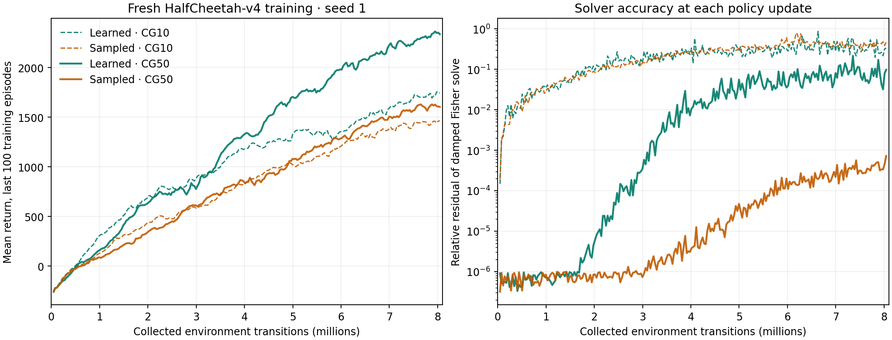

# Return-field natural actor v9

The hypothesis is that predicting reward–action-score cross moments gives the
actor useful state-conditioned credit in separate temporal, actuator, and
alpha/beta directions. Return maximization is the objective; fresh end-to-end
training returns judge the method. There is no GAE or scalar value head.

V9 retains v8's 11-band vector critic, complete-episode targets, exact temporal
support, leave-one-environment-out reward baseline, and tensor PopArt. The
critic predicts conditional cross moments directly, without generated futures
or a reward decoder. Scalar environmental rewards supply observations, not a
scalar critic bottleneck. See `return-field-v8.md` for the target derivation.

## Why change the actor

V8 reached 1814.62 final mean training return against -106.72 for its sampled
credit comparison. However, mean realized joint KL was 0.0017564 versus
0.000005106. Scaling the penalty from the unprojected noisy credit norm made
that comparison materially confounded by policy movement.

V9 replaces actor Adam and the scalar penalty with the same natural-gradient
solver for both credit sources. With F = L L^T the per-actuator Beta Fisher,
c the summed whitened credit, and J the actor-logit parameter Jacobian:

    ordinary parameter gradient g = mean[J^T sigmoid(logits) (L c)]
    actor Fisher H = mean[J^T sigmoid(logits) F sigmoid(logits) J]
    (H + damping I) d = g / norm(g)
    initial proposal scale = sqrt(2 KL_budget / (d^T H d))

The notation for sigmoid denotes the diagonal softplus derivative; tensor
coordinates retain the full coupled alpha/beta block. Fisher multiplication
uses L times (L transpose times the tangent), avoiding expansion followed by
cancellation of the small concentration-direction curvature. JVP/VJP operations avoid
materializing either J or H. The compiled actor operations use the complete
weighted batch. Ten conjugate-gradient iterations approximate the damped solve.
Normalizing the right-hand side only improves numerical conditioning: trust
scaling cancels a positive global credit multiplier. Damping changes direction;
the final scale uses undamped curvature.

Twelve line-search measurements expand/bracket along one direction and retain
the highest measured positive frozen-surrogate gain with exact mean joint
KL(old||new) at most 0.01. Every proposal starts from immutable old parameters.
Complete rejection restores them exactly. There is no actor optimizer history.
This is a bounded local search, not a global optimum or a monotonic-return
guarantee. Approximate critic errors can still make real returns worse.

## Training comparison

Both arms start freshly with seed 1, 16 HalfCheetah-v4 environments, two env
threads, and 8M requested transitions, including unused fragments and warmup.
Only complete episodes contribute targets. Learned credit fits the vector
critic; sampled credit supplies observed reward-score tensors directly. The
actor initialization, sampling stream, Fisher solver, and KL budget match.
Returns, realized KL, and solver residuals must be reported together. Different
credit directions can require different damping and can have different local
approximation errors; a shared solver does not prove all confounds absent.

No checkpoints are loaded. No held-out or fixed-policy promotion gate is used.
All CUDA contracts and training use MLQ with parallel limit 1. Contracts have
a 20-minute time limit; training has a 60-minute limit. Results are single-seed
training-episode returns, not a standard-PPO or state-of-the-art comparison.

## Execution

- MLQ 7505: 16 CUDA contracts passed; one failed an overly strict double-precision
  parameter tolerance for non-power-of-two credit rescaling (maximum difference
  about 2e-8). The test now distinguishes ordinary rescaling roundoff from
  power-of-two scaling, with explicit float64 inputs. Expanded coverage includes
  factored-Fisher and repeated compiled-update checks.
- MLQ 7506: all 21 CUDA contracts passed, including concentrated-Beta curvature,
  non-power-of-two and power-of-two reward scaling, and two compiled actor cycles.
- MLQ 7507: fresh learned field, completed 8,044,160 transitions. Final last-100
  mean return 1743.75; mean realized KL 0.00999303; mean CG relative residual
  0.22556 (maximum 0.86353). No line-search expansion-cap hits.
- MLQ 7508: fresh sampled credit, completed 8,044,160 transitions. Final last-100
  mean return 1464.69; mean realized KL 0.00999128; mean CG relative residual
  0.24710. The roughly 279-point learned-credit advantage in this seed is much
  smaller than the v8 comparison's confounded gap. Both solvers remain approximate.
- MLQ 7509 and 7510: fresh learned and sampled runs with 50 CG iterations,
  respectively. The large remaining residual in the ten-iteration learned run
  motivates this numerical-accuracy comparison. All other settings match;
  same v9 implementation, parallel limit 1 and 60-minute limits. MLQ 7509 completed
  at 2337.50 final mean return, mean KL 0.00999336, and mean CG residual 0.02964
  (maximum 0.21496). MLQ 7510 completed at 1604.79 final mean return, mean KL
  0.00999137, and mean CG residual 0.00008370 (maximum 0.00072018). More CG work
  substantially reduces the numerical residual but does not make every solve
  converge to its 1e-6 target.

## Completed evidence and interpretation

Every run completed 8,044,160 collected transitions and used 4,111,000 complete-
episode transitions for targets. All four runs started freshly with seed 1.
Scores below are the mean of the last 100 completed training episodes.

| CG iterations | Learned vector credit | Sampled vector credit | Learned minus sampled |
|---|---:|---:|---:|
| 10 | 1743.75 | 1464.69 | 279.06 |
| 50 | 2337.50 | 1604.79 | 732.71 |

All four mean realized KL values lie between 0.009991 and 0.009994. There were
no completely rejected updates or unbracketed expansion-cap hits. Unlike the v8
comparison, the sampled arm's policy movement is not suppressed by the raw
target noise norm.

At 50 CG iterations, learned credit finished 45.7% above sampled credit in this
seed. Increasing solver work improved the learned arm by 34.1% and the sampled
arm by 9.6%. This supports both learned conditional credit and more accurate
actor projection in this configuration. It does not establish that either
caused a reliable cross-seed improvement or that the critic is optimal.

The learned run retains larger solver residuals than the sampled run, even with
50 iterations. Potential limitations include critic-fitting bias and stale
future-policy context in retained critic weights. Discarding boundary fragments
also leaves about half the collected transitions unused for targets.
Normalized regression treats tensor coordinates separately; that conditions
fitting but is not a proof of minimum actor-gradient error. A future architectural
improvement should address these prediction and credit-assignment limitations,
and continue to be judged by fresh training returns. Increasing only the KL
ceiling or returning to fixed-policy variance gates is not justified here.

The 50-iteration learned configuration is the best completed v9 result, and
also exceeds v8's completed 1814.62 in this seed. These scores do not establish
competitiveness with standard PPO or state-of-the-art methods; neither was
benchmarked in this restricted-file experiment. No 50M run was launched.



Machine-readable [summary](return-field-natural-v9-results.json) includes exact
values, matched-step returns, and paths to all four full run artifacts. The
figure is also available as [SVG](return-field-natural-v9-results.svg).

Implementation: `cleanrl/ppo_continuous_action_return_field_natural_v9.py`.
CUDA contracts: `tests/test_return_field_natural_v9.py`.

Reproduce the best completed configuration from the repository root:

```bash
mlq submit --name return_field_natural_v9_cg50_learned_8M \
  --max-parallel-runs 1 --time-limit 60m --cwd "$PWD" \
  --env OMP_NUM_THREADS=1 --env MKL_NUM_THREADS=1 --env CLEANRL_ENV_SPIN=5000 -- \
  .venv/bin/python -u cleanrl/ppo_continuous_action_return_field_natural_v9.py \
  --env-id HalfCheetah-v4 --num-envs 16 --env-threads 2 \
  --exp-name return_field_natural_v9_cg50_learned_8M \
  --total-timesteps 8000000 --seed 1 --cg-iterations 50 \
  --credit-source learned --compile --compile-mode reduce-overhead
```

The frozen implementation retains its original default of ten CG iterations;
the improved setting is explicit in jobs 7509 and 7510.

## Subsequent KL 0.03 experiment

At the user's request, MLQ 7511 ran a fresh learned-CG50 experiment with
`--trust-kl 0.03`. Final return was 1916.55, below 2337.50 at KL 0.01, despite
better early learning. Mean actual KL was 0.0299791. See the
[result and supervision rethink](return-field-kl003-rethink.md) for the complete
comparison and the explicitly untested next design.
